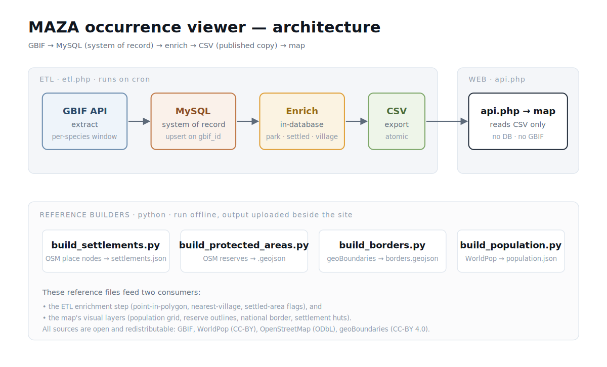
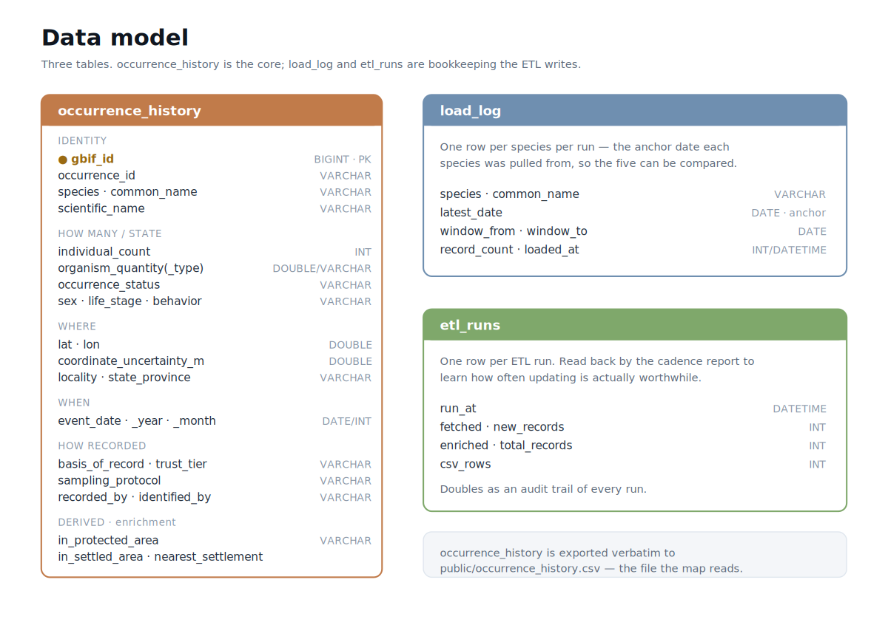

# MAZA Occurrence Viewer

**[Live map → mqala.co.za/gbif](https://www.mqala.co.za/gbif/)**

Data work for the NGO and conservation sector is often assumed to need a large
platform — Microsoft Fabric, Databricks, Snowflake — plus a proprietary mapping
and reporting layer on top. Those platforms are capable and convenient, and for
large workloads they are worth the price. But their licensing is high and
recurring, and not every project is large enough to need them: a Fabric capacity
runs from about **$260/month** to **~$8,400/month**, Databricks and Snowflake
production workloads reach into the thousands or tens of thousands per month, and
per-user mapping and reporting licences sit on top of that.

This project does the same kind of work — a real ETL pipeline, a relational
database as the system of record, enrichment, idempotent loads, and a schedule
that adjusts itself — at a size where free, self-hosted tools fit the job: PHP on
shared hosting, a MySQL database, Python for offline builds, Leaflet for the map.
It runs on about **$5/month**, with no licences and nothing that stops working
when a subscription ends. The subject here is geospatial, but the point is
matching the data-engineering stack to the size of the problem, not the map
itself.

It sits alongside real funded work — the IUCN–Total LandCare
[Human-Wildlife Co-habitation Project](https://iucn.org/news/202506/launch-human-wildlife-co-habitation-project-malawi-zambia-trans-frontier-conservation)
for the Malawi–Zambia TFCA (funded by Germany's BMZ through KfW) — not as part of
it, but using the same open data the field uses, to show what a low-cost,
self-hosted data layer for that area can look like.

---

An open-data pipeline and lightweight web map for species-occurrence records
along the Malawi–Zambia transfrontier landscape. It pulls records from
[GBIF](https://www.gbif.org/), makes **MySQL** the system of record, enriches
each row against population, protected-area and settlement references, and
publishes a cached **CSV** that a small Leaflet map reads — all designed to run
on **PHP 7.3 shared hosting**.

> **Scope.** This is a data-engineering project, not a human-wildlife-conflict
> study. It assembles open data into a clean, documented, queryable layer — a
> basic input specialists could use, with its limits stated plainly. A dot on
> the map is a *record*, not an animal or a census; blank space means "no
> record", never "no animals". See [`public/about.html`](public/about.html).

---

## Architecture



The core decision is splitting the **write path** from the **read path**:

- **`etl.php`** (cron) does the slow work — extract from GBIF, upsert into
  MySQL, enrich in-database, export a flat CSV. GBIF is queried on a schedule,
  never per visitor.
- **`api.php`** (web) only ever reads the published CSV. No database connection,
  no external dependency, no per-visitor API traffic at page load.

MySQL stays the system of record because enrichment, deduplication and history
are relational problems. The CSV is a projection of that state, regenerated each
run, never edited by hand.

See [`docs/ARCHITECTURE.md`](docs/ARCHITECTURE.md) for a stage-by-stage
walkthrough.

---

## Data model



Three tables: `occurrence_history` (the core, 40 columns grouped by what they
tell a reader about a record), plus `load_log` and `etl_runs` (bookkeeping the
ETL writes). Full column reference in [`docs/SCHEMA.md`](docs/SCHEMA.md).

A record is deliberately **not** treated as one animal: `individual_count` can
be a herd of forty, `basis_of_record` distinguishes a live sighting from a
museum specimen, and `occurrence_status` can record an absence. These columns
are what let that distinction survive into the map.

---

## Why build it this way

The usual stack for this kind of work is a large data platform plus a proprietary
mapping and reporting layer. Those platforms are good. They give you managed
infrastructure, tight integration, governance, and the room to grow — real value
that a hand-built stack does not offer. At scale it is worth paying for. The
question is not whether they are capable. It is whether the project in front of
you is large enough to need them.

Roughly what they cost:

| Component | Rough cost | What it gives you |
| --- | --- | --- |
| Fabric | ~$260/mo (F2) to ~$8,400/mo (F64), + Power BI Pro per user below F64 | managed capacity, integrated reporting, governance |
| Databricks | ~$8,000–50,000/mo at production scale (DBUs + VMs) | managed Spark, ML, scale |
| Snowflake | per-credit (~$2–4) + $23/TB; production often $15k–60k/mo | elastic compute, data sharing |
| ArcGIS Online / Pro | ~$500–760/user/yr; Pro Advanced ~$3,800–4,150/yr | full GIS toolset, support |
| Power BI Pro | per-user monthly subscription | polished dashboards, sharing |

This project sits at the other end of that range. It pulls a few hundred thousand
records, adds context, and publishes a map — a job one small server handles on
about **$5/month** of shared hosting, with open data and ordinary engineering
(extract, load, enrich, publish, schedule). At this size the free stack is not a
lesser choice. It fits the job, and it keeps running when the grant ends, with no
licence to renew.

The point is to match the tool to the size of the work:

- **Small, well-defined projects** — a bounded dataset, a few sources, a map or
  some reports — run fine on free, self-hosted tools. Using a large platform here
  means paying for a size you do not have.
- **As the work grows** — more pipelines, larger data, more users, stricter
  governance — the paid platforms start to make sense, and a mix of both becomes
  the practical answer: open tools and open data where they are enough, paid
  platforms where their convenience, scale, or integration is worth paying for.

The paid platforms are not wasteful, and free tools are not always better. The
expensive option is simply not the only option, and for budget-limited work at
this size the low-cost path is enough and lasts longer. Knowing where that line
sits, and building on the right side of it, is the skill that matters.

---

## Repository layout

```
.
├── README.md
├── LICENSE
├── .gitignore
├── maza_config.example.php      # copy to ../maza_config.php with real creds
│
├── pipeline/                    # the ETL and offline data builders
│   ├── schema.sql               # owns ALL table creation (drop + recreate)
│   ├── etl.php                  # extract → load → enrich → export CSV
│   ├── explore.php              # reads the data, prints mapping implications
│   ├── explore.sql              # raw exploratory queries
│   ├── load_history.php         # standalone loader (subset of etl.php)
│   ├── build_settlements.py     # OSM named places → settlements.json
│   ├── build_protected_areas.py # OSM reserves → protected_areas.geojson
│   ├── build_borders.py         # geoBoundaries → borders.geojson
│   └── build_population.py      # WorldPop raster → population.json
│
├── public/                      # everything served by the web host
│   ├── index.html               # the Leaflet map
│   ├── about.html               # plain-language scope note
│   ├── api.php                  # reads the CSV, returns JSON
│   └── assets/                  # vendored Leaflet + markercluster
│
└── docs/
    ├── ARCHITECTURE.md
    ├── SCHEMA.md
    └── diagrams/
        ├── architecture.png / .svg
        └── data-model.png / .svg
```

---

## Quick start

### 1. Requirements

- PHP 7.3+ with PDO MySQL (the code targets 7.3; newer works too)
- MySQL / MariaDB
- Python 3.8+ for the reference builders (`pip install requests shapely rasterio`)
- A web host that can serve `public/` and run PHP on cron

### 2. Credentials

```bash
cp maza_config.example.php ../maza_config.php   # keep it ABOVE the web root
# edit ../maza_config.php with your database credentials
```

`etl.php` reads this file and validates it, reporting the exact missing key
rather than failing deep in a connection call. The real `maza_config.php` is
git-ignored and must never be committed.

### 3. Create the database objects

```bash
mysql -u USER -p DBNAME < pipeline/schema.sql
```

`schema.sql` owns all table creation (drop-if-exists, then create). The PHP
never issues DDL — it checks the tables exist and stops with a clear message if
they don't.

### 4. Build the reference layers (offline, open network)

```bash
cd pipeline
python build_settlements.py        # → settlements.json
python build_protected_areas.py    # → protected_areas.geojson
python build_borders.py            # → borders.geojson  + provinces.geojson
python build_population.py         # → population.json
```

Upload the produced files into `public/` beside `index.html`.

### 5. Run the ETL

```bash
php pipeline/etl.php --days=3000    # extract → load → enrich → publish CSV
```

This writes `public/occurrence_history.csv` — the file the map reads.

### 6. Read what the data implies for the map

```bash
php pipeline/explore.php report.txt
```

`explore.php` turns the raw numbers into plain-text readings and mapping
implications (herds hidden in single dots, specimen vs observation mix, location
precision, present-vs-absent, and so on).

### 7. Schedule it, then let it calibrate

Add `etl.php` to cron, then after a few runs:

```bash
php pipeline/etl.php --cadence
```

The ETL logs each run's change-volume and reads that history back to recommend
how often running is actually worthwhile — instead of guessing a schedule.

---

## Data sources

All open and redistributable:

| Source | Provides | Licence |
| --- | --- | --- |
| [GBIF](https://www.gbif.org/) | species occurrence records | per-dataset (cite publishers) |
| [WorldPop](https://www.worldpop.org/) | 100 m gridded population | CC-BY 4.0 |
| [OpenStreetMap](https://www.openstreetmap.org/) | protected areas, settlements | ODbL |
| [geoBoundaries](https://www.geoboundaries.org/) | national + provincial outlines | CC-BY 4.0 |

---

## Design notes

A few decisions worth calling out, documented in full in
[`docs/ARCHITECTURE.md`](docs/ARCHITECTURE.md):

- **Per-species trailing window.** Each species is pulled relative to its own
  most recent sighting, not a fixed calendar range, because they don't record on
  the same schedule. The anchor dates are logged so their synchronisation is
  itself observable.
- **Nearest village, computed locally.** Rather than per-point reverse
  geocoding (disallowed as systematic querying, rate-limited to 1 req/s), the
  builder fetches named place nodes once for the bounding box and the ETL
  computes the nearest one locally, labelled with distance so it never
  overstates precision.
- **PHP 7.3 target.** No arrow functions; newer constants like
  `JSON_INVALID_UTF8_SUBSTITUTE` are guarded; encoding is normalised with
  `mbstring` when present and `iconv` as a fallback, so a missing extension
  degrades gracefully instead of returning a 500.

---

## Licence

Code released under the MIT Licence — see [`LICENSE`](LICENSE). Data retrieved
through the pipeline remains under its own source licences listed above; cite
GBIF publishers and the open-data providers when using their data.
